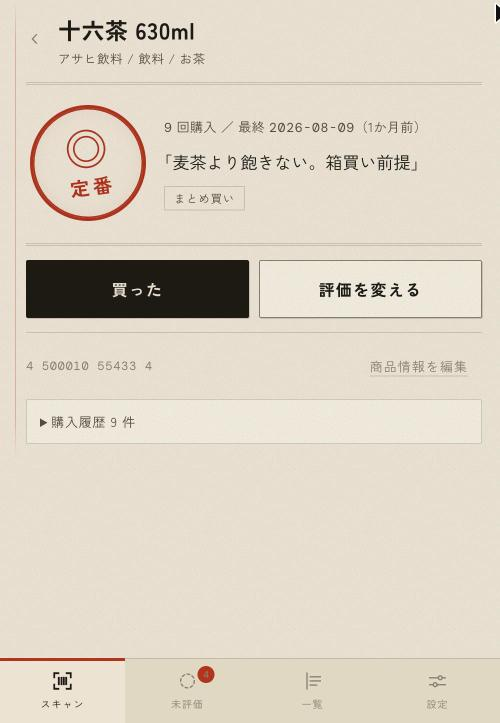
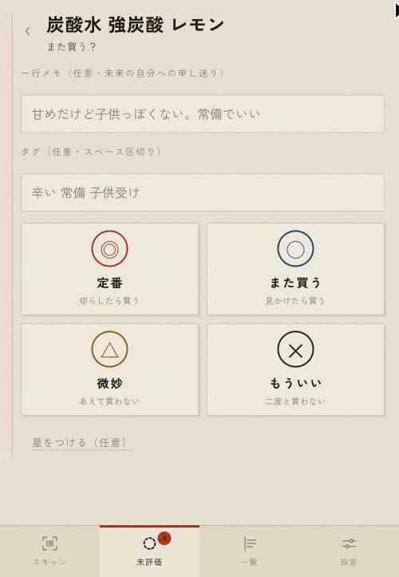
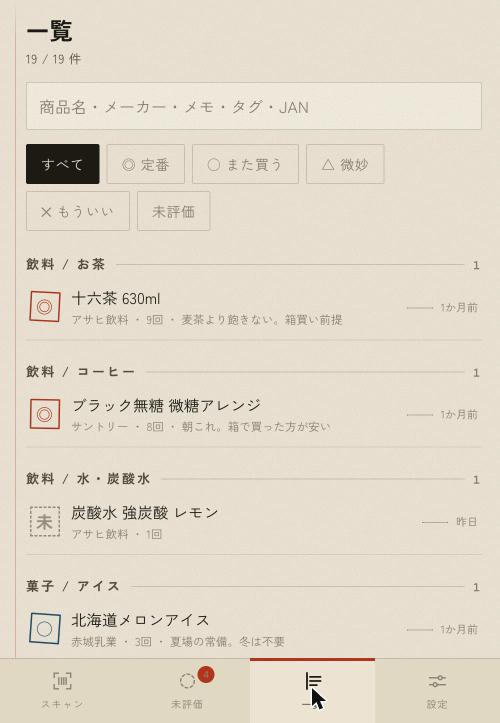
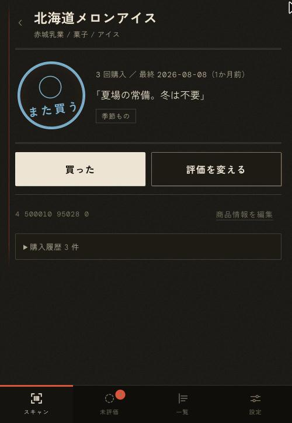

# matakore（またこれ）

[](https://github.com/hayato-osh/matakore/actions/workflows/ci.yml)

スーパーの棚の前でバーコードを読むと「また買うか」が3秒で分かる、1人用の食品評価データベース。
判定は端末の中のデータだけで出るので、電波の届かない店の奥でも動く。

ホスティングされたサービスではない。**自分の Cloudflare アカウントに立てて使う**。

- **スキャン**して既知の商品なら判定を出す（`◎ 定番` / `○ また買う` / `△ 微妙` / `✕ もういい`）
- 未知の JAN は商品名・メーカー・画像が自動で入る（Yahoo!ショッピング／楽天市場／Open Food Facts）。
  引けなくても商品名を打てば終わる
- **評価は後から**。買う瞬間に取るのは JAN と日付だけで、食べたあと未評価タブから1タップで付ける
- 記録は裏で Cloudflare D1 と差分同期する。機種変更しても新しい端末で開けば戻る
- JSON / CSV でいつでも全部持ち出せる

設計の意図と背景は [`DESIGN.md`](./DESIGN.md)、実装上の制約とコードの地図は [`CLAUDE.md`](./CLAUDE.md) にある。

## 画面

| 判定 | 評価 | 一覧 |
|:--:|:--:|:--:|
|  |  |  |
| 棚の前で見るのはこれだけ。<br>印・購入回数・過去の自分のメモ | 4値を1タップ。<br>星とメモとタグは任意 | カテゴリごとに印が並ぶ。<br>メモ・タグ・JAN で検索できる |

和紙（昼）と墨（夜）の2版がある。端末の設定に追従し、手動でも固定できる。



## 構成

**Cloudflare Worker 1本**で PWA と API を同一オリジンから配信する（`DESIGN.md` §6.2）。

| | |
|---|---|
| PWA | React + TypeScript + Vite。全件を Dexie（IndexedDB）に持ち、判定はここだけで完結する |
| API | Hono。`/api/*` だけが Worker に回る。外部 API のキーはここに隔離する |
| D1 | 解決済み商品マスタのキャッシュと、全記録の控え |
| 認証 | Cloudflare Access。アプリ内にログイン画面もトークン欄も無い |

バーコードは `BarcodeDetector`、無ければ zxing-wasm に落ちる（iOS Safari 対策）。
wasm もフォントも Service Worker に焼いてあるので、初回以降はオフラインで起動する。

## 動かす

Node 24 / pnpm 10 以上。

```bash
pnpm install
cp wrangler.example.jsonc wrangler.jsonc   # ローカルはこのままで動く
cp .dev.vars.example .dev.vars             # DEV_NO_AUTH=1。ローカルでは Access 検証を外す
pnpm migrate:local                         # D1 をローカルに作る
pnpm dev                                   # PWA と /api が同じポートに上がる
```

Yahoo!／楽天のアプリIDが無くても動く（日本の食品はほぼ引けないが、配線の確認はできる）。
`.dev.vars` のキーは値が空でも消さないこと。`pnpm types` がここからキーを拾って `Env` の型を作る。
`wrangler.jsonc` と `.dev.vars` は自分の環境の値を入れる場所なので git に入れない。

スマホ実機で試すときは `HTTPS=1 pnpm dev:host`。カメラはセキュアコンテキストでしか動かないため、
LAN 経由で開くには HTTPS が要る（自己署名なので初回は警告を踏み越える）。

## 自分の Cloudflare に立てる

必要なもの: Cloudflare アカウント（無料枠で足りる）、Cloudflare に DNS を置いたドメイン1つ、
Zero Trust（Access。無料枠あり）。Yahoo!／楽天のアプリIDは任意。

**1. Access のアプリを作る**（Zero Trust → Access → Applications → Add an application → Self-hosted）

Application domain に配信したいホスト名を入れ、Policy は Allow に自分のメールアドレスだけ。
Session duration は長め（1か月）にする。店頭で毎回ログインさせないため。
作成後の Overview に出る **Application Audience (AUD) Tag** と、Zero Trust の
**Team domain**（`<team>.cloudflareaccess.com`）を控える。

**2. D1 を作る**

```bash
npx wrangler login
npx wrangler d1 create matakore
```

**3. `wrangler.jsonc` を自分の値にする**

| キー | 入れるもの |
|---|---|
| `routes[0].pattern` | 配信するホスト名。DNS と証明書は Cloudflare が Custom Domain として自動で持つ |
| `d1_databases[0].database_id` | `d1 create` が出した ID |
| `vars.ACCESS_TEAM_DOMAIN` | Zero Trust の Team domain |
| `vars.ACCESS_AUD` | Access アプリの AUD Tag |
| `vars.OFF_USER_AGENT` | Open Food Facts に名乗る UA。連絡先を自分のものにする |

**4. デプロイ**

```bash
pnpm deploy                              # build して wrangler deploy
pnpm migrate:remote                      # D1 のスキーマを作る
npx wrangler secret put YAHOO_APP_ID     # https://e.developer.yahoo.co.jp/（任意）
npx wrangler secret put RAKUTEN_APP_ID   # https://webservice.rakuten.co.jp/（任意）
```

Access を設定しないままデプロイすると `/api` は 503 を返すが、判定（ローカル）は動く。

スマホで URL を開いてログインし、ホーム画面に追加する。iOS はホーム画面アプリと Safari で
保存領域が別なので、記録はホーム画面側で付け始めること。

## コマンド

| コマンド | 内容 |
|---|---|
| `pnpm dev` / `dev:host` | 開発サーバ（`dev:host` は LAN に公開） |
| `pnpm build` / `preview` | 本番ビルド / ビルド結果を Worker ごと動かす |
| `pnpm deploy` | build して `wrangler deploy` |
| `pnpm test` / `lint` / `typecheck` | vitest / oxlint / `tsc -b` |
| `pnpm types` | `worker-configuration.d.ts` を再生成（`wrangler.jsonc` のキーを変えたら） |
| `pnpm migrate:local` / `migrate:remote` | D1 マイグレーション |

## ライセンス

[MIT](./LICENSE)。アイコンもこのリポジトリのもので同じ扱い。
同梱している webfont の Zen Kaku Gothic New と DM Mono は SIL Open Font License 1.1。
